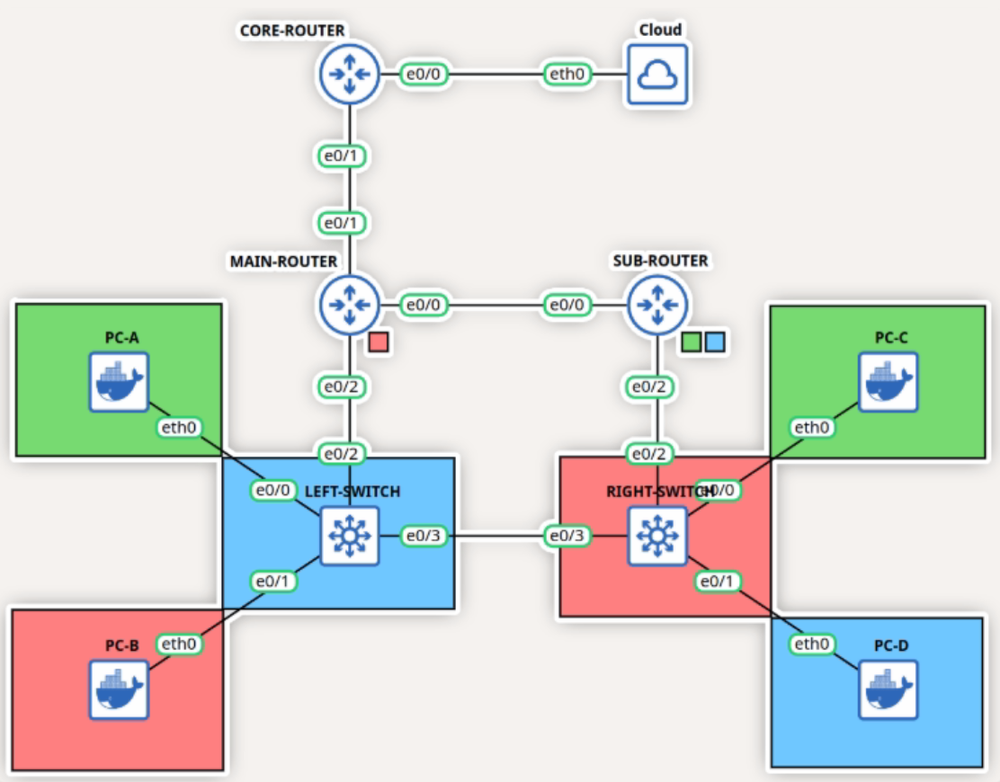

# ใส่ค่าลงในตารางด้านล่าง และ Configure อุปกรณ์ให้ถูกต้องครบถ้วน ตามข้อกำหนดดังต่อไปนี้

---

## 1. การกำหนด Subnet IPv4 ระหว่าง Router

กำหนดให้ Subnet IPv4 ที่เชื่อมต่อกันระหว่าง Router คือ **192.168.1.176/28**

### เงื่อนไข
- ให้นักศึกษาแบ่ง Subnet ออกเป็น **2 Subnets** โดย Assign ให้กับ Network ระหว่าง Router **ตามลำดับเท่านั้น**
- แต่ละ Subnet ต้องมี IP Address ที่สามารถใช้งานได้ **2 IP** และต้องมีขนาด **ใกล้เคียงที่สุด**

### Subnet ระหว่าง CORE-ROUTER และ MAIN-ROUTER
- CORE-ROUTER ใช้ IPv4 Address เป็น **Host IP ลำดับที่ 1**
- MAIN-ROUTER ใช้ IPv4 Address เป็น **Host IP ลำดับสุดท้าย**
- กำหนด Default Gateway ของ MAIN-ROUTER ชี้ไปที่ CORE-ROUTER

### Subnet ระหว่าง MAIN-ROUTER และ SUB-ROUTER
- MAIN-ROUTER ใช้ IPv4 Address เป็น **Host IP ลำดับที่ 1**
- SUB-ROUTER ใช้ IPv4 Address เป็น **Host IP ลำดับสุดท้าย**
- กำหนด Default Gateway ของ SUB-ROUTER ชี้ไปที่ MAIN-ROUTER

---

## 2. การกำหนด Subnet สำหรับ VLAN

กำหนดให้ Subnet IPv4 คือ **172.e.0.0/23**  
(โดยค่า `e` เป็นตัวเลขที่สุ่มขึ้นมา ซึ่งแตกต่างกันในแต่ละคน)

### เงื่อนไขทั่วไป
- ให้นักศึกษาแบ่ง Subnet ออกเป็น **3 Subnets** สำหรับ VLAN **X, Y และ Z**  
- ต้อง Assign Subnet **ตามลำดับเท่านั้น**
- VLAN X, Y และ Z เป็นตัวเลขที่สุ่มขึ้นมา (แตกต่างกันในแต่ละคน)
- อุปกรณ์ PC ทุกเครื่องรับ IP ผ่าน **DHCP จาก CORE-ROUTER**
- DNS ของทุก VLAN คือ IP ของ CORE-ROUTER ที่อยู่ใน Subnet ระหว่าง CORE-ROUTER และ MAIN-ROUTER

---

### Subnet ที่ 1 : VLAN X
**สมาชิก:** PC-A, PC-C

- ต้องมี IP ที่ใช้งานได้อย่างน้อย **127 IP**
- PC-A ใช้ IPv4 Address เป็น **Host IP ลำดับที่ 2**
- PC-C ใช้ IPv4 Address เป็น **Host IP ลำดับที่ 100–120**
- Default Gateway อยู่ที่ **SUB-ROUTER (Sub-interface)**  
  โดยใช้ IPv4 Address เป็น **Host IP ลำดับที่ 1**

---

### Subnet ที่ 2 : VLAN Y
**สมาชิก:** PC-B, RIGHT-SWITCH

- ต้องมี IP ที่ใช้งานได้อย่างน้อย **60 IP**
- PC-B ใช้ IPv4 Address เป็น **Host IP ลำดับที่ 20–30**
- RIGHT-SWITCH ใช้ IPv4 Address บน VLAN Interface (VLAN Y)  
  โดยใช้ **Host IP ลำดับสุดท้าย**
- Default Gateway อยู่ที่ **MAIN-ROUTER**  
  โดยใช้ IPv4 Address เป็น **Host IP ลำดับที่ 1**

---

### Subnet ที่ 3 : VLAN Z
**สมาชิก:** PC-D, LEFT-SWITCH

- ต้องมี IP ที่ใช้งานได้อย่างน้อย **17 IP**
- PC-D ใช้ IPv4 Address เป็น **Host IP ลำดับที่ 5–10**
- LEFT-SWITCH ใช้ IPv4 Address บน VLAN Interface (VLAN Z)  
  โดยใช้ **Host IP ลำดับสุดท้าย**
- Default Gateway อยู่ที่ **SUB-ROUTER (Sub-interface)**  
  โดยใช้ IPv4 Address เป็น **Host IP ลำดับที่ 1**

---

## 3. การเชื่อมต่อ CORE-ROUTER กับ Cloud (Internet)

กำหนดให้ Subnet ระหว่าง CORE-ROUTER และ Cloud คือ **10.70.38.0/24**  
(Subnet กลางของคณะ)

### เงื่อนไข
- เชื่อมต่อ Cloud ผ่าน Interface แบบ **Bridge หรือ eth0**
- กำหนด IPv4 Address ของ CORE-ROUTER เป็น Management IP  
  ในรูปแบบ **10.70.38.P/24**  
  (ค่า `P` เป็นตัวเลขที่สุ่มขึ้นมา แตกต่างกันในแต่ละคน)
- Default Route สำหรับออก Internet คือ **10.70.38.1**
- ใช้ NAT แบบ **PAT (Port Address Translation)**  
  เพื่อให้ Network ภายใน Topology ออก Internet ผ่าน IP ของ CORE-ROUTER
